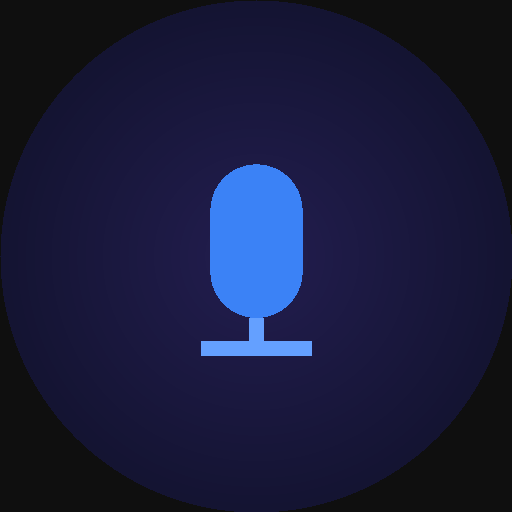

# Water Voice

AI音声入力アプリ。話した音声をGemini APIで文字起こし・整形し、結果を前面のアプリへ自動で貼り付けます。



## Features

- グローバルホットキーで録音開始/停止
- Gemini APIによる音声認識と文章整形
- フィラーワード除去、句読点付与、段落整形
- 録音開始時に前面にあったアプリへの自動貼り付け (OFFにするとクリップボード保存と完了音)
- 貼り付け後に元のクリップボード内容を復元
- Command Mode: 選択テキストを音声の指示(「もっと簡潔に」「英訳して」など)で書き換え。未選択なら指示どおりに新規作成
- カスタム辞書 最大800語
- 履歴 最大100件
- macOS / Windows対応
- ログイン時の自動起動
- APIキー接続確認
- Escまたは録音オーバーレイクリックで録音キャンセル

## Install

[Releases](https://github.com/utoutoshuto/water-voice/releases/latest) から最新版をダウンロードしてください。

### macOS (Apple Silicon)

1. `Water.Voice-<version>-arm64.dmg` を開き、Water Voice を Applications フォルダへドラッグ
2. 公証(notarization)していないため、初回起動前にターミナルで隔離属性を外す

   ```bash
   xattr -cr "/Applications/Water Voice.app"
   ```

3. 起動するとメニューバーに常駐します。マイクの許可ダイアログで「許可」を選択
4. 自動貼り付けを使う場合は、システム設定 > プライバシーとセキュリティ > アクセシビリティ で Water Voice を ON

アップデート時は同じ手順で上書きしてください。署名が変わるとマイク/アクセシビリティの許可が外れることがあるため、その場合は再度許可してください。

### Windows

`Water.Voice.Setup.<version>.exe` を実行してください。未署名のため SmartScreen の警告が出た場合は「詳細情報」→「実行」を選択します。

## Release

`package.json` の version を上げてタグを push すると、GitHub Actions が macOS / Windows 版をビルドして Releases に公開します。

```bash
git tag v1.4.0
git push origin v1.4.0
```

## Requirements

| 項目 | 要件 |
| --- | --- |
| OS | macOS 10.13以上 / Windows 10以上 |
| Node.js | 20以上 |
| Gemini APIキー | Google AI Studioで取得 |
| マイク | 任意の入力デバイス |

macOSではマイク権限が必要です。自動貼り付けとCommand Modeにはアクセシビリティ権限も必要です(システム設定 > プライバシーとセキュリティ > アクセシビリティ)。権限がない場合はクリップボード保存にフォールバックし、ホーム・設定画面に案内が表示されます。

## Setup

```bash
npm install
npm run dev
```

## Build

```bash
# Rendererだけをビルド
npm run build

# 配布パッケージを生成
npm run pack
```

生成物は`release/`へ出力されます。

### macOSの署名

macOSでは署名 identity が変わると、再インストール時にマイク・アクセシビリティの許可（TCC）がリセットされることがあります。開発配布でも同じ自己署名証明書を継続して使ってください。

初回だけ、ローカル署名用の自己署名証明書を作成してログインキーチェーンへ追加します。

```bash
openssl req -x509 -newkey rsa:2048 -keyout water-voice-local.key -out water-voice-local.crt \
  -days 3650 -nodes -subj '/CN=Water Voice Local' -addext 'extendedKeyUsage=codeSigning'
openssl pkcs12 -export -out water-voice-local.p12 -inkey water-voice-local.key \
  -in water-voice-local.crt -name 'Water Voice Local'
security import water-voice-local.p12 -k ~/Library/Keychains/login.keychain-db -T /usr/bin/codesign
security find-identity -v -p codesigning
rm water-voice-local.key water-voice-local.crt water-voice-local.p12
```

以後は identity 名を固定してビルドします。`CSC_NAME` を指定しない場合は ad-hoc 署名（`-`）になります。

```bash
CSC_NAME='Water Voice Local' npm run dist
```

Apple Developer の Developer ID 証明書を使う場合も、同じように `CSC_NAME` にその identity 名を指定します。

## Usage

1. 設定画面でGemini APIキーを入力して保存
2. ホットキーを押して録音開始
3. 話す
4. もう一度ホットキーを押して録音停止
5. Geminiが整形したテキストを、録音開始時に前面にあったアプリへ貼り付ける
   - 自動貼り付けがOFF、権限がない、またはWater Voiceのウィンドウが前面だった場合は、クリップボードへ保存して完了音を鳴らす

既定ホットキーは`CommandOrControl+Shift+Space`です。
録音中に`Esc`を押すか、録音オーバーレイをクリックすると録音を破棄します。

### Command Mode

1. 書き換えたいテキストを選択する(新規作成したい場合は選択せずカーソルを置く)
2. コマンドモードのホットキー(既定`CommandOrControl+Shift+E`)を押す。オーバーレイが紫色の「コマンド」表示になる
3. 「もっと簡潔に」「英訳して」「箇条書きにして」などと指示を話す
4. もう一度ホットキーを押すと、Geminiの結果で選択範囲を置き換える(未選択なら指示どおりに作成したテキストを挿入する)

選択テキストは開始時に`Cmd/Ctrl+C`で取得し、元のクリップボード内容は取得後に復元します。自動貼り付けがOFFの場合、結果はクリップボードへ保存のみ行います。

## Settings

| 設定 | 説明 |
| --- | --- |
| APIキー | Gemini APIの認証キー |
| ホットキー | 録音開始/停止のキー |
| コマンドモードのホットキー | Command Modeの開始/停止キー。空にすると無効 |
| 前面のアプリに自動で貼り付け | 整形結果を録音開始時の前面アプリへ貼り付けるか。OFFでクリップボード保存と完了音 |
| 貼り付け後にクリップボードを復元 | 貼り付け後、少し待って元のクリップボード内容に戻すか |
| 言語 | 音声認識に使う言語 |
| フィラーワード除去 | 「えー」「あー」などを削除するか |
| ログイン時に自動起動 | OS起動時にアプリを起動するか |
| カスタム辞書 | 固有名詞や専門用語の優先語 |

## Project Structure

```text
water-voice/
├── main.js
├── preload.js
├── src/
│   ├── App.jsx
│   ├── renderer.jsx
│   ├── pages/
│   │   ├── Home.jsx
│   │   ├── Settings.jsx
│   │   ├── History.jsx
│   │   ├── Dictionary.jsx
│   │   └── Overlay.jsx
│   └── styles/
│       └── global.css
├── assets/
├── entitlements.mac.plist
└── webpack.config.js
```

## Notes

- 既存の設定キーと履歴形式は維持しています。
- 開発環境はNode.js 20系を推奨します。`.nvmrc`とVolta設定を同梱しています。
- 自動貼り付けはmacOSではSystem Events経由の`Cmd+V`、WindowsではSendKeysによる`Ctrl+V`で行います。
- APIが混雑している場合は自動でリトライし、`gemini-2.5-flash`から`gemini-2.0-flash`へフォールバックします。
- Windowsインストーラーはインストール開始時に起動中のWater Voiceを終了します。

## License

MIT
